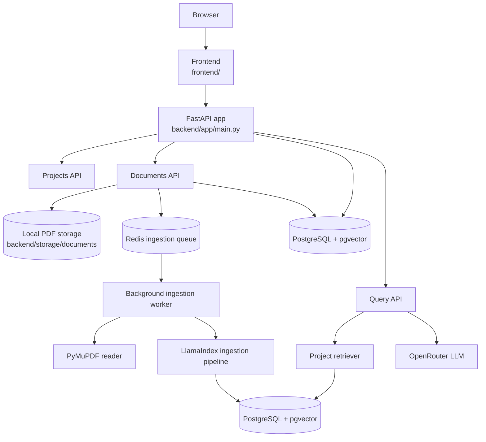

# Research Workspace

Research Workspace is a production-oriented RAG playground for computer science papers.

It combines a FastAPI backend with a React frontend so you can:

- create and switch between projects
- upload PDF papers into a project
- store metadata in PostgreSQL
- queue ingestion work in Redis
- parse, chunk, embed, and index documents with LlamaIndex
- ask project-scoped questions and receive grounded answers

The codebase is organized around business capabilities such as `projects`, `documents`, `ingestion`, `retrieval`, and `query` rather than a generic service/repository layering.

## Architecture



### Runtime Flow

1. A PDF is uploaded through the frontend or the documents API.
2. The file is saved locally under `backend/storage/documents`.
3. A document row is created in PostgreSQL and a job is pushed to Redis.
4. The background worker picks up the job, reads the PDF, enriches metadata, chunks the text, embeds nodes, and writes them into pgvector.
5. The query endpoint builds a retriever for the selected project and synthesizes an answer with the configured LLM.

## Frontend

The frontend lives in `frontend/` and is a Vite-based React application built with TypeScript, Chakra UI, Zustand, Axios, `react-dropzone`, and `react-markdown`.

### Frontend Features

- project selector with project creation
- PDF upload panel for the active project
- document list sidebar with loading and error states
- chat view for project-scoped Q&A
- markdown rendering for model responses
- LLM status display in the top bar
- responsive two-pane layout for desktop and mobile

### Frontend Layout

- `src/api/` API clients for backend requests
- `src/components/Admin/` admin controls and related UI
- `src/components/Chat/` chat area, message bubbles, and input
- `src/components/Files/` file upload, file list, and file error UI
- `src/components/Layout/` shell, header, and status display
- `src/state/` Zustand stores for chat, files, and projects
- `src/styles/` Chakra theme overrides

### Frontend Notes

- The chat area auto-scrolls to the newest message and shows a loading spinner while the backend responds.
- The sidebar fetches projects on load and refreshes the file list when the active project changes.
- Empty state handling prompts the user to select or create a project before chatting.
- The app uses a minimal Chakra theme with light styling and rounded controls.

## Repository Layout

- `backend/app/main.py` FastAPI application entrypoint.
- `backend/app/projects` project CRUD and schemas.
- `backend/app/documents` document upload, listing, and lookup.
- `backend/app/ingestion` PDF ingestion pipeline and storage helpers.
- `backend/app/retrieval` project-scoped retrieval logic.
- `backend/app/query` question-answering orchestration.
- `backend/app/background` Redis queue and ingestion worker.
- `backend/app/infrastructure` database and Redis clients.
- `backend/storage/documents` local PDF storage used at runtime.
- `frontend/` React frontend for project management, uploads, and chat.

## Requirements

- Python 3.12 or newer
- `uv`
- Node.js 18+ for the frontend
- Docker and Docker Compose
- PostgreSQL 18 with `pgvector`
- Redis 8

## Environment Variables

Copy `.env.example` to `.env` and fill in your local values.

Important settings:

- `DATABASE_URL` SQLAlchemy connection string used by the app and Alembic
- `REDIS_URL` Redis connection string used by the background queue
- `POSTGRES_*` values used by the vector store and Docker Compose
- `GOOGLE_API_KEY` kept for future ingestion or model integrations
- `OPENROUTER_API_KEY` used by the query LLM
- `EMBEDDING_MODEL` Hugging Face embedding model name
- `GENERATION_MODEL` OpenRouter model name for answer generation
- `CHUNK_SIZE`, `CHUNK_OVERLAP`, `TOP_K`, `MAX_TOKENS`, and `TEMPERATURE` for retrieval and generation tuning
- frontend API base URL or proxy settings, if you are not using the default local backend address

## Run Locally

### 1. Start PostgreSQL and Redis

From the repository root:

```powershell
docker compose up -d
```

This starts the `pgvector` PostgreSQL container and Redis on the default local ports.

### 2. Configure the backend

From `backend/`, install dependencies and prepare the environment:

```powershell
uv sync
```

Make sure `backend/.env` exists and contains valid values for `DATABASE_URL`, `REDIS_URL`, and your API keys.

### 3. Run migrations

From `backend/`:

```powershell
uv run alembic upgrade head
```

### 4. Start the API

From `backend/`:

```powershell
uv run uvicorn app.main:app --reload --host 0.0.0.0 --port 8000
```

Open the interactive API docs at:

- `http://localhost:8000/docs`

### 5. Start the ingestion worker

Run this in a second terminal from `backend/`:

```powershell
uv run python -m app.background.worker
```

The worker must be running if you want uploaded PDFs to move from `QUEUED` to `INDEXED`.

### 6. Start the frontend

From `frontend/`:

```powershell
npm install
npm run dev
```

By default, Vite serves the app on the local development URL shown in the terminal.

## Main API Endpoints

- `GET /` health-style root response
- `POST /projects`
- `GET /projects`
- `GET /projects/{project_id}`
- `POST /documents/upload`
- `GET /projects/{project_id}/documents`
- `GET /documents/{document_id}`
- `POST /projects/{project_id}/query`

## Notes

- The application is optimized for RAG experimentation, not generic CRUD.
- Business logic lives in services; routers stay thin.
- Infrastructure code is isolated under `app/infrastructure` and `app/providers`.
- Secrets, local databases, PDFs, caches, and virtual environments are ignored by default through `.gitignore`.

## Attribution

The frontend in this workspace is adapted from the original
[Local Chat RAG](https://github.com/TAMustafa/Local_Chat_RAG) repository by **TAMustafa**.

This project keeps that credit intact and extends the UI to fit the Research Workspace backend.
